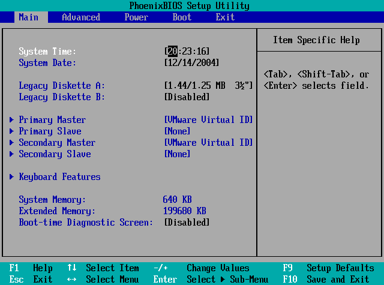
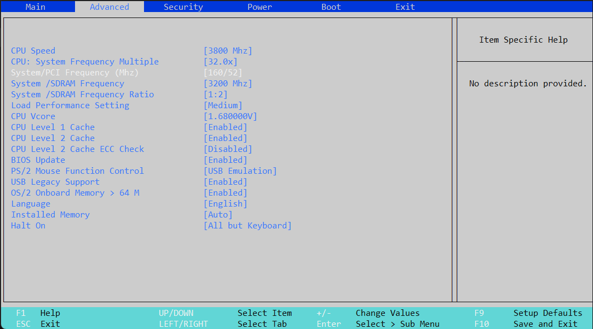

# Basic Input Output System sandbox

This project was made for people who want to learn how bios settings work and how to operate with them without braking your pc.

So what this project apparently does, it gives you an ability to tweak in real time various bios settings and see how they affect the system

---

### 🖼️Original BIOS

---

### 🖼️BIOS Sandbox

---
